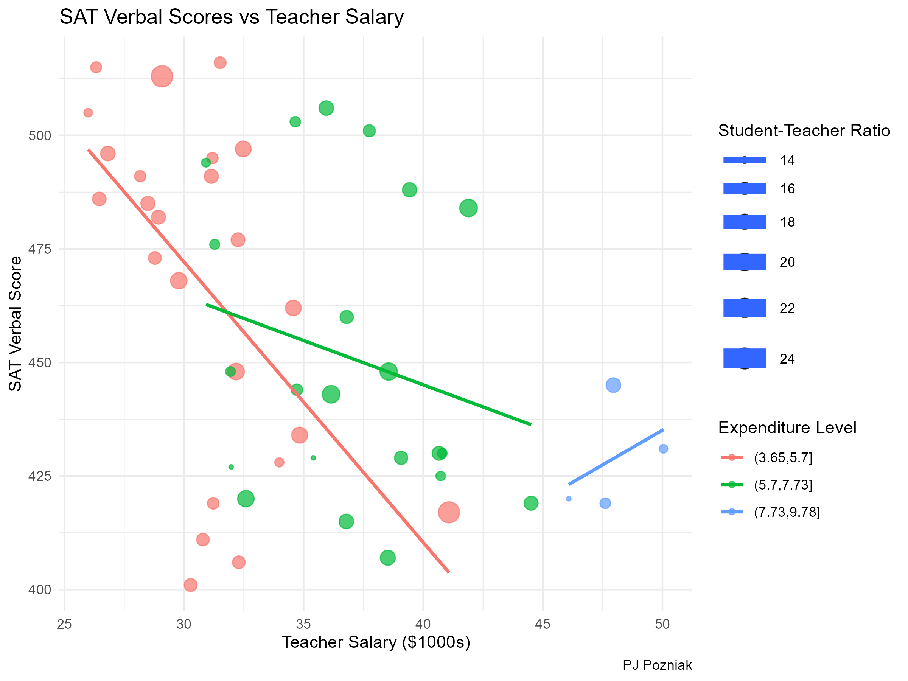

Use this file to generate a professional looking **quadvariate** visualization.  The visualization will not perfect the first time but you are expected to improve on it throughout the semester especially after covering advanced topics such as effective viz.

```{r}
education <- read.csv("https://mac-stat.github.io/data/sat.csv")
library(tidyverse)
```


```{r}

# Load necessary libraries
library(ggplot2)

# Create the plot
p <- ggplot(education, aes(x = salary, y = verbal, color = cut(expend, 3), size = ratio)) + 
  geom_point(alpha = 0.7) + 
  geom_smooth(se = FALSE, method = "lm") +
  labs(title = "SAT Verbal Scores vs Teacher Salary",
       x = "Teacher Salary ($1000s)",
       y = "SAT Verbal Score",
       color = "Expenditure Level",
       size = "Student-Teacher Ratio",
       caption = "PJ Pozniak") +
  theme_minimal()

# Show the plot
p

# Save the plot as an image for web or further use
ggsave("sat_verbal_vs_salary.png", plot = p, height = 6, width = 8)

# Display alt text for accessibility
cat('

')

```

